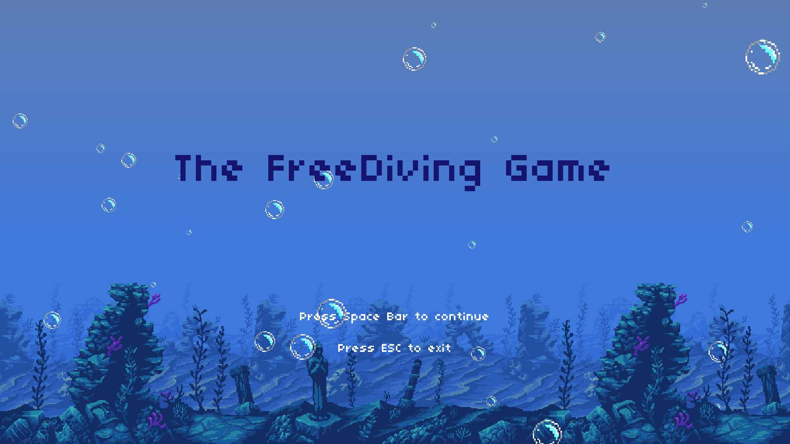

# How to Launch the Game

To start the game, follow these steps:

1. **Using the Executable File:**
   - Click on the `.exe` file to launch the game.
   - **Important:** Do not move the `.exe` file from its original folder, as this may cause errors.

2. **Using the Python Script:**
   - If you prefer to run the game through the source code, ensure you have all the necessary requirements installed.
   - Once the requirements are set up, run the `main.py` file.

---

Feel free to modify the game as you wish!

## Contact Information
**Author:** Côme HOSXE  
**Email:** come.hosex@gmail.com  
